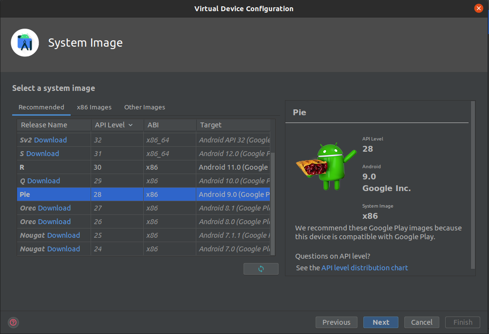

<h1 align="center">PicPay Clone - Aplicativo móvel</h1>

### Instruções:

**OBS:** A API do back-end deve estar rodando!

- No arquivo `local.properties`, configurar o local da pasta do Android/Sdk
- Pegar o ip da sua máquina local, no terminal do Linux: `hostname -I`
- Colocar o seu ip local nos arquivos `network-security-config.xml` e `RetrofitService.kt` *(linha 12)*
---
- Caso esteja a utilizar o Intellij, ao criar o DeviceManager, utilize o modelo de celular `Pixel 2` e versão do sistema `API Level 28`

---

- E a sua API Android foi configurada, agora suba a API com o DeviceManager criado!

---

- Caso esteja com dificuldades ao fazer login no app, utilize estas credenciais para acessar o app: Usuário-> `pedrovf` | Senha: `123456`

---

A API do back-end está no repositório: **https://github.com/gui-meireles/PicPayClone-API.git**
